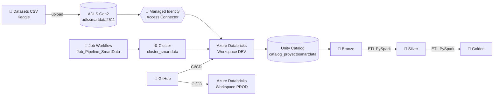
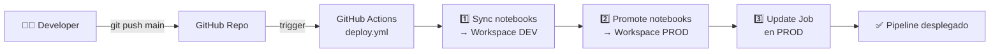
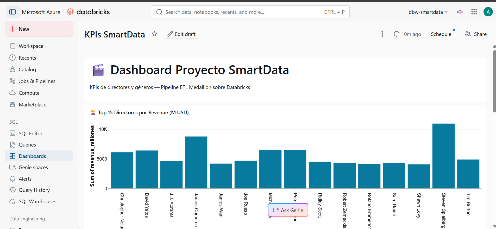
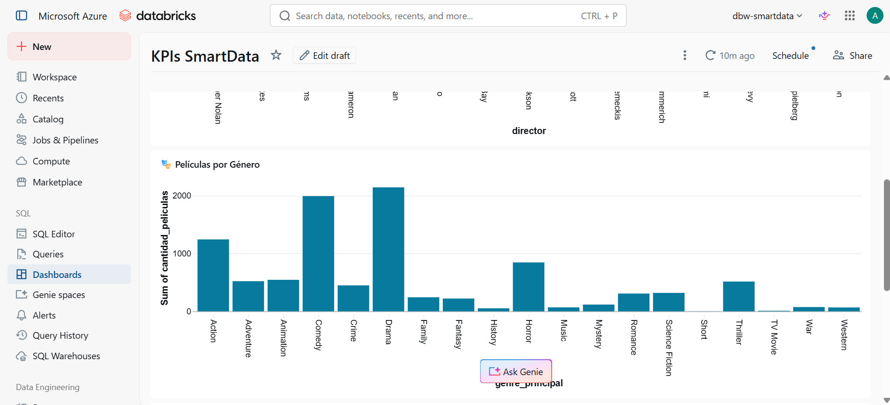
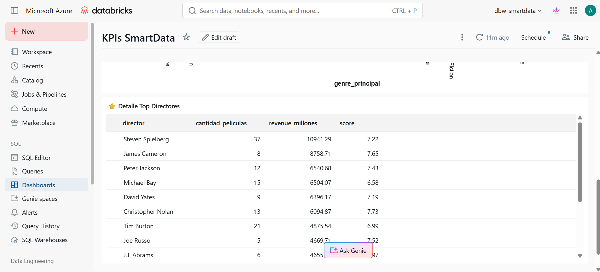

# 🎬 Proyecto Final — Ingeniería de Datos e IA con Databricks

[](https://github.com/adrianomjm/proyecto-final-databricks-smartdata/actions/workflows/deploy.yml)


Pipeline **ETL Medallion** sobre **Azure Databricks + ADLS Gen2** con autenticación **Managed Identity** (Access Connector + Unity Catalog), orquestado por **Databricks Jobs** y desplegado automáticamente con **GitHub Actions** (CI/CD `dev → prod`).

**Caso de uso:** análisis de la industria del cine — KPIs de directores, géneros, presupuestos y revenue.

---

## 🏗️ Arquitectura



### Flujo CI/CD dev → prod



### Flujo de datos (Medallion)

| Capa | Origen | Destino | Transformaciones |
|------|--------|---------|------------------|
| 🥉 Bronze | CSVs en `raw/` | Tablas Delta crudas | Casteo de tipos, lectura sin transformación |
| 🥈 Silver | Bronze | Tabla Delta limpia | JOIN entre fuentes, cálculo de profit y ROI |
| 🥇 Golden | Silver | KPIs Delta | Agregaciones por director y género |

---

## 🥇 KPIs generados (capa Golden)

| Tabla | Granularidad | Métricas calculadas |
|---|---|---|
| `golden.kpi_por_director` | 1 fila por director | `total_peliculas`, `revenue_total`, `profit_total`, `roi_promedio`, `score_promedio` |
| `golden.kpi_por_genero` | 1 fila por género | `total_peliculas`, `revenue_total`, `budget_promedio`, `roi_promedio`, `runtime_promedio` |

---

## 📊 Dashboard

Dashboard nativo de Databricks construido sobre las tablas `golden.*`.

| Vista 1 — KPIs principales | Vista 2 — Top directores | Vista 3 — Géneros |
|:---:|:---:|:---:|
|  |  |  |

---

## 🔄 Pipeline CI/CD (GitHub Actions)

Cada `git push` a `main` dispara el workflow `.github/workflows/deploy.yml` que:

1. **Sincroniza notebooks** de la carpeta `proceso/` y `PrepAmb/` al workspace **DEV** (`dbw-smartdata`) vía Databricks CLI
2. **Promociona los notebooks ya validados** al workspace **PROD** (`dbw-smartdata-prod`)
3. **Actualiza el Job** `Job_Pipeline_SmartData` en PROD con la última versión

### Secrets requeridos en GitHub

| Secret | Descripción |
|---|---|
| `DATABRICKS_DEV_HOST` | URL workspace DEV |
| `DATABRICKS_DEV_TOKEN` | PAT del workspace DEV |
| `DATABRICKS_PROD_HOST` | URL workspace PROD |
| `DATABRICKS_PROD_TOKEN` | PAT del workspace PROD |

---

## 📂 Estructura del repositorio

| Carpeta | Contenido |
|---|---|
| `datasets/` | CSVs fuentes (Movies, FilmDetails, MoreInfo, PosterPath, Ecommerce, Automobile) |
| `PrepAmb/` | Notebook de preparación de ambiente (esquemas + tablas) |
| `proceso/` | Notebooks ETL: ingesta, transformación, carga y orquestador |
| `reversion/` | Script SQL para limpiar/eliminar todo el ambiente |
| `seguridad/` | Script SQL con GRANTs por rol |
| `.github/workflows/` | Pipeline CI/CD `deploy.yml` |
| `dashboard/` | Capturas del dashboard final |
| `evidencias/` | Capturas de ejecución (Azure, Databricks, Job, Managed Identity) |

---

## 🧱 Capas Medallion

### 🥉 Bronze — Datos crudos en Delta
- `bronze.movies` — 9,718 registros de películas
- `bronze.film_details` — 9,718 registros con director, presupuesto, revenue

### 🥈 Silver — Datos limpios + JOIN entre fuentes
- `silver.movies_enriched` — 9,718 registros con:
  - JOIN entre `movies` + `film_details` por `id`
  - `runtime_min_total` (horas × 60 + minutos)
  - `release_year` extraído del `release_date`
  - `genre_principal` (primer género del listado)
  - `profit_usd` y `roi_pct` calculados

### 🥇 Golden — KPIs analíticos
- `golden.kpi_por_director` — top directores por revenue, profit, score
- `golden.kpi_por_genero` — métricas por género

---

## 🔐 Servicios Azure utilizados

| Servicio | Nombre | Propósito |
|---|---|---|
| Resource Group | `rg-proyectosmartdata` | Contenedor lógico |
| Storage Account (ADLS Gen2) | `adlssmartdata2511` | Data lake (raw, bronze, silver, golden, metastore) |
| Databricks Workspace **DEV** | `dbw-smartdata` | Desarrollo y pruebas |
| Databricks Workspace **PROD** | `dbw-smartdata-prod` | Producción (CI/CD target) |
| Access Connector | `unity-catalog-access-connector` | **Managed Identity** hacia ADLS |
| Unity Catalog | `catalog_proyectosmartdata` | Catálogo + 3 esquemas |
| Cluster | `cluster_smartdata` | Standard_D8plds_v6, 8 cores, Spark 3.5 |
| Job | `Job_Pipeline_SmartData` | Workflow orquestado |

---

## 🔑 Autenticación: Managed Identity (sin passwords)

```
Databricks ──[Storage Credential]──> Access Connector ──> ADLS Gen2
                                            │
                                            └─ Rol: Storage Blob Data Contributor
```

**External Locations registradas en Unity Catalog:**
`extloc-raw` · `extloc-bronze` · `extloc-silver` · `extloc-golden` · `extloc-metastore`

---

## ▶️ Cómo ejecutar el pipeline

### Opción 1 — Manual desde Databricks
1. Cargar los CSVs al container `raw` del ADLS
2. Abrir `proceso/5.Orquestador.py` en Databricks
3. Ejecutar — llama secuencialmente a:
   - `1.Preparacion_Ambiente` (crea esquemas y tablas)
   - `2.Ingest_Movies` y `2.Ingest_FilmDetails` (RAW → BRONZE)
   - `3.Transform_Silver` (BRONZE → SILVER)
   - `4.Load_Golden` (SILVER → GOLDEN)

### Opción 2 — Job automatizado
Ejecutar el **Job** `Job_Pipeline_SmartData` desde Workflows en Databricks.

### Opción 3 — CI/CD desde GitHub
`git push origin main` → GitHub Actions despliega automáticamente a PROD.

---

## 🛡️ Seguridad y reversión

- `seguridad/grants.sql` — GRANTs por rol (admin, analyst, reader)
- `reversion/cleanup.sql` — DROP de catálogo, esquemas, tablas y external locations

---

## 🛠️ Stack tecnológico

- **Azure Databricks** (Runtime 17.3 LTS)
- **Apache Spark 4.0** + **PySpark**
- **Delta Lake** (formato de tabla)
- **Unity Catalog** (gobierno de datos)
- **Azure Data Lake Storage Gen2**
- **Managed Identity** (autenticación sin secrets)
- **GitHub Actions** (CI/CD multi-ambiente)
- **Databricks CLI** (deployment automation)

---

## 📸 Evidencias de ejecución

| # | Captura | Descripción |
|---|---|---|
| 1 | [02_unity_catalog.png](evidencias/02_unity_catalog.png) | Unity Catalog con 3 esquemas |
| 2 | [03_job_ejecutado.png](evidencias/03_job_ejecutado.png) | Job ejecutado exitosamente |
| 3 | [04_managed_identity.png](evidencias/04_managed_identity.png) | Access Connector + IAM |

---

## 👤 Autor

**Adriano Juárez** — Grupo G13 · Ingeniería de Datos e IA con Databricks · Smart Data 2026
