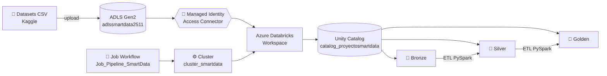

# 🎬 Proyecto Final — Ingeniería de Datos e IA con Databricks

Pipeline ETL **Medallion** sobre **Azure Databricks + ADLS Gen2** con autenticación vía **Managed Identity** (Access Connector + Unity Catalog).

**Caso de uso:** análisis de la industria del cine — KPIs de directores, géneros, presupuestos y revenue.

---

## 🏗️ Arquitectura

### Flujo de datos (Medallion)

| Capa | Origen | Destino | Transformaciones |
|------|--------|---------|------------------|
| 🥉 Bronze | CSVs en `raw/` | Tablas Delta crudas | Casteo de tipos, lectura sin transformación |
| 🥈 Silver | Bronze | Tabla Delta limpia | JOIN entre fuentes, cálculo de profit y ROI |
| 🥇 Golden | Silver | KPIs Delta | Agregaciones por director y género |
---

## 📂 Estructura del repositorio

| Carpeta | Contenido |
|---|---|
| `datasets/` | CSVs fuentes del proyecto (Movies, FilmDetails, MoreInfo, PosterPath, Ecommerce, Automobile) |
| `PrepAmb/` | Notebook de preparación de ambiente (esquemas + tablas) |
| `proceso/` | Notebooks de ETL: ingesta, transformación, carga y orquestador |
| `reversion/` | Script SQL para limpiar/eliminar todo el ambiente |
| `seguridad/` | Script SQL con GRANTs por rol |
| `.github/workflows/` | Pipeline CI/CD para deploy a Databricks |
| `dashboard/` | Capturas y JSON del dashboard final |
| `evidencias/` | Capturas de ejecución correcta (Azure, Databricks, Job) |

---

## 🧱 Capas Medallion

### 🥉 Bronze — Datos crudos en Delta
- `bronze.movies` — 9718 registros de películas
- `bronze.film_details` — 9718 registros con director, presupuesto, revenue

### 🥈 Silver — Datos limpios + JOIN entre fuentes
- `silver.movies_enriched` — 9718 registros con:
  - Joins entre `movies` + `film_details` por `id`
  - `runtime_min_total` (horas × 60 + minutos)
  - `release_year` extraído del `release_date`
  - `genre_principal` (primer género del listado)
  - `profit_usd` y `roi_pct` calculados

### 🥇 Golden — KPIs analíticos
- `golden.kpi_por_director` — top directores por revenue, profit, score
- `golden.kpi_por_genero` — métricas por género

---

## 🔐 Servicios Azure utilizados

| Servicio | Nombre | Propósito |
|---|---|---|
| Resource Group | `rg-proyectosmartdata` | Contenedor lógico |
| Storage Account (ADLS Gen2) | `adlssmartdata2511` | Data lake (raw, bronze, silver, golden, metastore) |
| Databricks Workspace (Premium) | `dbw-smartdata` | Motor de cómputo |
| Access Connector | `unity-catalog-access-connector` | **Managed Identity** hacia ADLS |
| Unity Catalog | `catalog_proyectosmartdata` | Catálogo + 3 esquemas |
| Cluster | `cluster_smartdata` | Standard_D8plds_v6, 8 cores, Spark 3.5 |
| Job | `Job_Pipeline_SmartData` | Workflow orquestado |

---

## 🔑 Autenticación: Managed Identity (sin passwords)

Databricks ──[Storage Credential]──> Access Connector ──> ADLS Gen2
│
Rol: Storage Blob Data Contributor

**External Locations registradas en Unity Catalog:**
- `extloc-raw`, `extloc-bronze`, `extloc-silver`, `extloc-golden`, `extloc-metastore`

---

## ▶️ Cómo ejecutar el pipeline

1. Cargar los CSVs al container `raw` del ADLS
2. Abrir el notebook `proceso/5.Orquestador.py` en Databricks
3. Ejecutar — el orquestador llama secuencialmente:
   - `1.Preparacion_Ambiente` (crea esquemas y tablas)
   - `2.Ingest_Movies` y `2.Ingest_FilmDetails` (RAW → BRONZE)
   - `3.Transform_Silver` (BRONZE → SILVER con JOIN)
   - `4.Load_Golden` (SILVER → GOLDEN con KPIs)

Alternativa: ejecutar el **Job** `Job_Pipeline_SmartData` desde Workflows.

---

## 🛠️ Tecnologías

- **Azure Databricks** (Runtime 17.3 LTS)
- **Apache Spark 4.0** (PySpark)
- **Delta Lake** (formato de tabla)
- **Unity Catalog** (gobierno de datos)
- **Azure Data Lake Storage Gen2**
- **Managed Identity** (autenticación sin secrets)
- **GitHub Actions** (CI/CD)

---

## 👤 Autor

**Adriano Juárez** — Grupo G13 · Ingeniería de Datos e IA con Databricks · 2026
